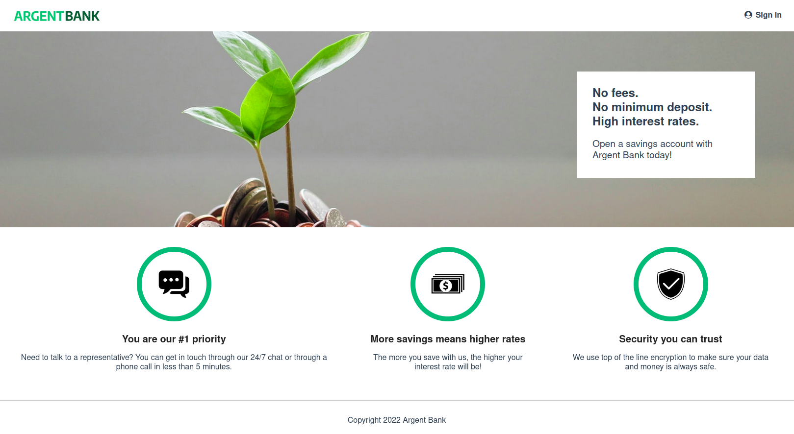

# Argent Bank

## Présentation du contexte

## Ce que ce projet m'a permis de pratiquer

### Compétences

- découper et intégrer une maquette,
- structurer une page web en composants React,
- gérer l'état d'une application avec Redux,
- mettre en forme une page web avec HTML et CSS3.

### Technologies / méthodes

- HTML5 / CSS3,
- Sass,
- React, React DOM, React Router,
- Redux.

## Ressources à ma disposition

* maquettes desktop et mobile.

## Consignes

- créer l'application avec React,
- utiliser Redux pour gérer l'état de l'application.

## Livrables attendus

- découpage en composants modulaires et réutilisables,
- un composant par fichier,
- structure logique des différents fichiers,
- utilisation des props entre les composants,
- utilisation du state dans les composants quand c'est nécessaire,
- gestion des événements,
- composants à base de classe, aucun composant fonction,
- le code ne devait pas produire d'erreur ou de warning dans la console.

